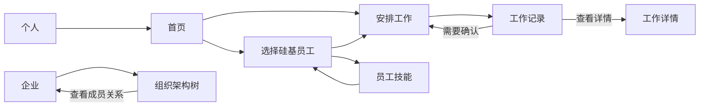
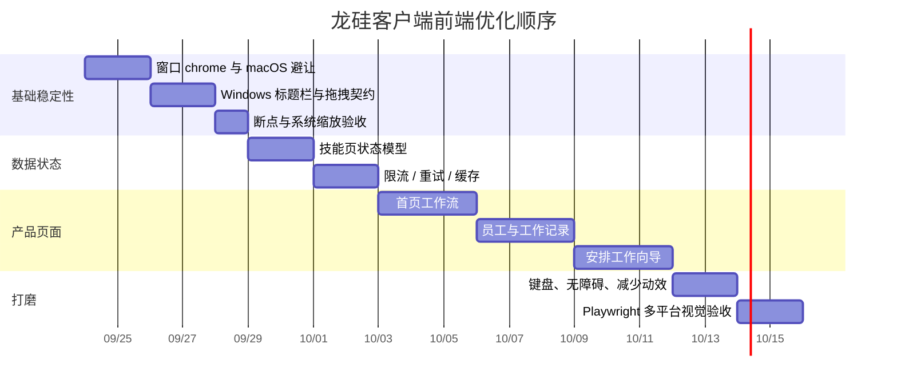

# 龙硅客户端前端产品与跨平台布局方案

> 状态：设计基线（先文档，后分阶段实现）  
> 日期：2026-09-24  
> 适用范围：Electron 桌面客户端、登录后工作台、macOS / Windows  30.0

---

## 1. 结论先行

当前客户端已经具备「左侧导航 + 顶部标题栏 + 页面内容」的基本骨架，但还不能算一个稳定的桌面产品，主要原因不是颜色或圆角，而是三个基础问题：

1. **窗口系统层和应用层没有完全分离**：macOS 原生红黄绿按钮覆盖到了左上角企业 Logo / 公司名称；Windows 的自定义标题栏按钮也依赖内容区避让，容易在窄窗口或长标题下发生碰撞。
2. **工作台缺少明确的任务主线**：导航项目齐全，但首页、员工、安排工作、工作记录、员工技能之间的优先级和下一步动作还不够突出。
3. **异常状态没有产品化**：技能页面遇到服务端限流时，目前容易呈现「0 个技能」，用户会误以为没有权限或没有数据；网络错误、空数据、加载中、过期会话需要明确区分。

本方案的方向是：

> **专业的企业 AI 工作台 = 稳定的桌面窗口骨架 + 清晰的工作流 + 低噪音的信息密度 + 可解释的状态反馈。**

不建议继续堆叠装饰效果。应先把窗口层级、导航层级、页面状态和跨平台交互做正确，再做品牌动效和视觉细节。

---

## 2. 当前实现审查

### 2.1 当前结构

当前相关结构如下：

```text
BrowserWindow
└── renderer
    └── .ent-shell                         100dvh 横向工作台
        ├── AppSideNav                     左侧 232px 导航
        │   ├── 企业 Logo / 企业名
        │   ├── 首页 / 硅基员工 / 安排工作 / 工作记录 / 员工技能
        │   └── 底部账号菜单
        └── .ent-shell-main
            ├── AppTopBar                  右侧顶部标题、视图切换、通知
            └── .ent-scroll                页面滚动区
                ├── 首页
                ├── 硅基员工
                ├── 安排工作
                ├── 工作记录
                └── 员工技能
```

代码位置：

| 区域 | 文件 |
|---|---|
| Electron 窗口 | `electron/bootstrap/main-window.ts` |
| 页面外壳 | `src/pages/ClientAppPage.tsx` |
| 左侧导航 | `src/components/enterprise/AppSideNav.tsx` |
| 顶部栏 | `src/components/enterprise/AppTopBar.tsx` |
| 企业视觉变量与布局 | `src/styles/enterprise.css` |
| 技能列表页 | `src/pages/enterprise/SkillsPage.tsx` |
| 技能请求聚合 | `src/features/enterprise/use-skill-library.ts` |

### 2.2 左上角重叠的直接原因

当前 Electron 窗口配置：

```ts
{
  titleBarStyle: 'hidden',
  titleBarOverlay: {
    color: '#f1f1f0',
    symbolColor: '#6f6567',
    height: 44,
  },
}
```

当前左侧品牌区从窗口内容的 `y=0` 开始：

```css
.ent-side-brand {
  height: 60px;
}
```

也就是说，渲染页面认为左上角是普通应用内容，但 macOS 把原生交通灯按钮绘制在同一块区域。于是：

```text
当前 macOS（问题）

┌─────────────────────────────────────────────────────────────┐
│  ● ● ●    [企业 Logo] 常州数易网络科技…       页面标题        │
│  ↑原生按钮       ↑应用内容，占用了同一坐标区                  │
└─────────────────────────────────────────────────────────────┘
```

### 2.3 当前配置中还存在的跨平台风险

- `titleBarOverlay` 的避让主要写在 `.ent-top` 的右侧 padding 中，属于「内容层避让窗口按钮」，但没有独立的窗口 chrome contract。
- macOS 与 Windows 的窗口按钮方向、位置、可拖拽区域不同，不能只依靠一套固定 `padding`。
- `.electron-drag-region` 区域必须保证所有按钮、输入框和下拉菜单都明确设为 `no-drag`，否则可能出现「点击控件变成拖动窗口」。
- `minWidth: 960`、`minHeight: 640` 下，长企业名、页面标题、顶部操作组需要测试截断和折叠，而不能假设 1200×800 永远存在。
- 技能页面请求失败时，业务列表保持空数组，用户看到的「0 个技能」和「请求失败」的语义容易混在一起。

---

## 3. 产品定位与专业感原则

### 3.1 产品定位

龙硅不是一个普通聊天窗口，而是一个面向企业员工的「数字劳动力调度工作台」：

- **首页**：今天要推进什么工作？有哪些员工可用？哪些事情需要我确认？
- **硅基员工**：我可以把工作交给谁？每个员工擅长什么？当前是否忙碌？
- **安排工作**：我如何把一个目标拆给员工，并确认输入、权限和执行方式？
- **工作记录**：工作进行到哪一步？谁做了什么？哪里需要我处理？
- **员工技能**：员工使用哪些技能？版本是否可用？失败是权限、网络还是服务端限流？

### 3.2 专业感的 6 条原则

1. **先给结论，再给细节**：页面顶部先告诉用户当前状态和下一步动作。
2. **主操作只有一个**：每个页面必须有一个视觉上最明确的 CTA，避免多个紫色按钮争夺注意力。
3. **状态必须可解释**：加载中、空数据、无权限、网络失败、限流、会话过期不能用同一套空白页面表示。
4. **数据密度可控**：默认展示摘要；详情通过抽屉、详情页或展开区域承载。
5. **桌面优先但不假定大屏**：1200×800 是舒适态，960×640 是可用态，低于可用态要折叠而不是溢出。
6. **动效服务于反馈**：只使用页面进入、状态变更、加载和操作确认等动效；不让粒子、光晕和持续动画干扰工作。

---

## 4. 同类应用可借鉴的模式

以下不是照搬视觉，而是提取成熟产品在信息组织上的共性。

| 产品 / 模式 | 借鉴点 | 不照搬的部分 |
|---|---|---|
| Slack / 企业 IM | 工作区身份稳定放在左侧；导航、未读、上下文层级清晰 | 不采用消息产品的高密度频道树，龙硅的核心是工作执行 |
| Notion | 页面标题、层级导航和内容留白；空状态文案清楚 | 不采用无限文档树，避免把工作台变成知识库 |
| Linear | 首页突出当前工作；列表、状态和快捷操作紧凑；命令式操作效率高 | 不把所有功能隐藏到快捷键，企业用户仍需要可发现的导航 |
| VS Code | 左侧稳定工具区、中心工作区、顶部窗口控制区；适合长时间工作 | 不使用过暗的 IDE 视觉，保持企业管理场景的可读性 |
| Figma | 画布与侧栏边界明确；浮层不破坏主工作区 | 自动编排页面可借鉴画布，但不把所有页面做成画布 |
| Raycast / Spotlight | 对高频动作提供命令入口和快捷键 | 作为增强能力，不替代首页和导航 |

### 4.1 参考资料

- Electron 自定义标题栏与窗口选项：<https://www.electronjs.org/docs/latest/tutorial/custom-title-bar>
- Electron `BrowserWindow` 选项：<https://www.electronjs.org/docs/latest/api/browser-window>
- Linear：<https://linear.app/>
- Notion：<https://www.notion.so/product>
- Slack：<https://slack.com/features>
- VS Code Workbench：<https://code.visualstudio.com/docs/getstarted/userinterface>

---

## 5. 推荐的信息架构

### 5.1 两个工作视角，而不是权限系统

当前客户端的登录用户主要是普通用户，因此“个人 / 企业”用于切换工作视角，不用于表达管理员权限。顶部居中放置简短切换控件：

```text
[个人] [企业]
```

- **个人**：围绕“我现在要做什么”，展示个人工作和已订阅的硅基员工。
- **企业**：围绕“我所在的组织”，主要用于查看组织架构和人员关系。

当前用户不需要看到“技能审核、员工权限、企业设置”等管理后台入口。后续即使增加管理员能力，也应在权限确认后单独扩展，不能污染普通用户的默认工作台。

```text
龙硅客户端
├── 个人
│   ├── 首页                         今天的工作概览
│   ├── 硅基员工                     找到合适的员工并查看状态
│   ├── 安排工作                     创建对话式 / 自动编排 / 手动工作
│   ├── 工作记录                     查看进行中、待确认、已完成、失败
│   └── 员工技能                     查看技能、版本与可用性
│
└── 企业
    └── 组织架构                     以可视化树查看组织成员关系
```

### 5.2 全局工作流



个人空间的核心闭环是：

```text
发现员工 → 说明目标 → 确认输入 / 权限 → 执行 → 查看过程 → 处理异常 / 确认 → 结果沉淀
```

企业空间的核心任务是：

```text
查看组织全貌 → 展开部门 → 定位成员 → 查看轻量关系信息
```

### 5.3 个人与企业切换规范

切换控件固定在顶部栏中间，不放进左侧导航，也不和窗口控制按钮混在一起：

```text
┌────────────────────────────────────────────────────────────────────┐
│ ● ● ●   龙硅                 [个人] [企业]          🔔  ◐  刘凌 ▾    │
└────────────────────────────────────────────────────────────────────┘
```

- 当前视角使用实心主色，未选视角使用浅色底或透明底。
- “个人”与“企业”是稳定、短、可扫描的简称，不使用长文案挤压页面标题。
- 右上角固定放通知、主题切换和账号入口。
- 企业视角下左侧导航只保留“组织架构”；切回个人后恢复个人工作导航。
- 切换视角不应丢失当前页面状态；返回时保留上一次页面和滚动位置，除非会话已失效。

---

## 6. 推荐的工作台总布局

### 6.1 结构示意图

```text
┌────────────────────────────────────────────────────────────────────────┐
│ ● ● ●   龙硅                    [个人] [企业]       🔔  ◐  刘凌 ▾       │
├───────────────┬────────────────────────────────────────────────────────┤
│               │  页面标题                                             │
│  首页         │  副标题 / 面包屑                    主操作             │
│  硅基员工     ├────────────────────────────────────────────────────────┤
│  安排工作     │                                                        │
│  工作记录  ③  │                 页面内容区                             │
│  员工技能     │      最大宽度 1180，左右留白 28~40                     │
│               │                                                        │
│  ─────────    │      卡片 / 列表 / 工作流 / 组织树                     │
│  刘凌         │                                                        │
│  我的账号  ⌃  │                                                        │
└───────────────┴────────────────────────────────────────────────────────┘
```

左侧导航和右侧页面内容遵循统一骨架。个人 / 企业只是切换内容上下文，不引入另一套完全不同的视觉风格。

### 6.2 尺寸基线

| 区域 | 舒适态 | 可用态 | 说明 |
|---|---:|---:|---|
| 窗口默认尺寸 | 1200×800 | — | 当前值可保留 |
| 最小窗口 | — | 960×640 | 当前值可保留，但必须有折叠规则 |
| 左侧导航 | 232~248px | 208~220px | 过窄时只保留图标并显示 tooltip |
| 顶部栏 | 64px | 56px | 包含窗口安全区策略、视角切换和全局操作 |
| 页面最大宽度 | 1180px | 100% | 内容区居中，避免超宽拉伸 |
| 页面左右内边距 | 28~40px | 16~20px | 小窗口收缩 |
| 页面模块间距 | 20px | 16px | 所有业务页面统一 |
| 卡片间距 | 16px | 12px | 网格和列表统一 |
| 卡片内边距 | 20px | 16px | 保持内容呼吸感 |
| 交互控件最小高度 | 34px | 34px | 兼顾桌面密度与可点击性 |
| 输入框高度 | 38px | 36px | 搜索和表单统一 |
| 页面标题 | 20px / 600 | 18px / 600 | 标题不随页面类型变化 |
| 模块标题 | 15px / 600 | 14px / 600 | 统一层级 |
| 正文 / 辅助文字 | 13px / 11px | 13px / 11px | 保证桌面端可读性 |
| 主卡片圆角 | 10~12px | 10px | 不继续增加圆角层级 |

### 6.3 个人首页布局

个人首页回答“我现在要做什么”，不放“快速开始”按钮组，而是优先展示待处理工作、进行中的工作和已经订阅的硅基员工。

```text
┌────────────────────────────────────────────────────────────────────┐
│ 个人工作台                                  ＋ 安排工作             │
│ 今天的工作，从这里开始                                              │
├────────────────────────────────────────────────────────────────────┤
│ 早上好，刘凌                                                        │
│ 今天有 2 项工作需要你处理                                           │
├──────────────────┬──────────────────┬──────────────────────────────┤
│ 待我确认         │ 进行中的工作      │ 我的硅基员工                 │
│ 2 项             │ 3 项              │ 8 位                        │
│ 立即处理 →       │ 查看工作 →        │ 查看员工 →                   │
├──────────────────┴──────────────────┴──────────────────────────────┤
│ 最近工作                                                             │
│ ● 官网内容更新       内容员工      进行中       查看详情 →           │
│ ● 客户资料整理       数据员工      待确认       立即处理 →            │
├────────────────────────────────────────────────────────────────────┤
│ 已订阅的硅基员工                               ‹  1 / 3  ›            │
│                                                                      │
│  ┌────────────┐   ┌────────────┐   ┌────────────┐                   │
│  │ 头像       │   │ 头像       │   │ 头像       │                   │
│  │ 内容员工   │   │ 数据员工   │   │ 浏览员工   │                   │
│  │ 空闲       │   │ 工作中     │   │ 空闲       │                   │
│  │ 开始对话 → │   │ 查看工作 → │   │ 开始对话 → │                   │
│  └────────────┘   └────────────┘   └────────────┘                   │
│                         ● ─ ● ─ ○                                  │
└────────────────────────────────────────────────────────────────────┘
```

已订阅员工区域使用横向滚动或分页指示器，卡片保持固定可读宽度，不为了在窗口内塞下所有员工而缩小文字。卡片上的主操作根据员工状态显示“开始对话”或“查看工作”。

### 6.4 硅基员工页面

```text
┌────────────────────────────────────────────────────────────────────┐
│ 硅基员工                                  搜索员工                  │
│ 查看能力、状态与最近工作                                              │
├────────────────────────────────────────────────────────────────────┤
│ [搜索姓名 / 能力] [全部状态⌄] [全部部门⌄]                   卡片 / 列表 │
├────────────────────────────────────────────────────────────────────┤
│ ┌──────────────┐  ┌──────────────┐  ┌──────────────┐                │
│ │ 头像 内容员工 │  │ 头像 数据员工 │  │ 头像 浏览员工 │                │
│ │ 空闲          │  │ 工作中        │  │ 需确认        │                │
│ │ 擅长：…       │  │ 当前：…       │  │ 擅长：…       │                │
│ │ [开始对话]    │  │ [查看工作]    │  │ [处理确认]    │                │
│ └──────────────┘  └──────────────┘  └──────────────┘                │
└────────────────────────────────────────────────────────────────────┘
```

卡片上只放决策所需信息：身份、状态、主要能力、当前工作和一个主操作。长描述进入详情，不在卡片中堆叠。

### 6.5 安排工作页面

安排工作是产品核心，应采用“步骤明确的工作台”而非一张大表单：

```text
┌────────────────────────────────────────────────────────────────────┐
│ 安排工作                         保存草稿             开始执行      │
├────────────────────┬───────────────────────────────────────────────┤
│ 01 选择工作方式    │                                               │
│ 02 选择员工        │              当前步骤内容                       │
│ 03 描述目标        │        目标 / 输入 / 权限 / 技能                 │
│ 04 确认并开始      │                                               │
│                    │                                               │
│ 进度：第 2 步 / 4  │                              [上一步] [下一步] │
└────────────────────┴───────────────────────────────────────────────┘
```

自动编排画布可以保留，但应放在“自己编排”模式中；普通用户默认先看到可理解的向导，不让空画布成为首屏门槛。

### 6.6 工作记录页面

工作记录是可追溯性中心，默认按“需要我处理”优先：

```text
┌────────────────────────────────────────────────────────────────────┐
│ 工作记录                                      [需要我处理] [全部]    │
├────────────────────────────────────────────────────────────────────┤
│ [搜索工作] [状态⌄] [员工⌄] [时间⌄]                         刷新      │
├────────────────────────────────────────────────────────────────────┤
│ 今天                                                                 │
│ ● 需要确认  官网内容更新        内容员工    5分钟前      [处理]      │
│ ● 进行中    客户资料整理        数据员工    18分钟前     [查看]      │
│ ● 已完成    月度报告生成        报告员工    昨天         [查看]      │
└────────────────────────────────────────────────────────────────────┘
```

状态颜色不能单独承担语义，应使用“颜色 + 图标 + 文字”，例如：

- 进行中：蓝紫圆点 + `进行中`；
- 需要确认：琥珀提示图标 + `需要你确认`；
- 失败：红色警告图标 + `执行失败`；
- 已完成：绿色勾选图标 + `已完成`。

### 6.7 员工技能页面

技能页必须区分四种状态：

```text
加载中       正在读取员工技能…              骨架屏
有数据       共 12 个技能                   卡片 / 列表
无数据       当前账号没有已授权技能          解释 + 去员工页
加载失败     服务暂时不可用                  重试 + 错误原因
被限流       请求过于频繁，请稍后重试        倒计时 / Retry-After
```

禁止把失败状态渲染成：

```text
共 0 个技能
```

推荐页面结构：

```text
┌────────────────────────────────────────────────────────────────────┐
│ 员工技能                                      刷新                  │
│ 查看技能原文、版本和使用它的硅基员工                               │
├────────────────────────────────────────────────────────────────────┤
│ [搜索技能名称、描述或关键词] [全部技能⌄]                            │
├────────────────────────────────────────────────────────────────────┤
│ 共 12 个技能 · 修改后保存为个人版本，不覆盖企业发布版               │
├────────────────────────────────────────────────────────────────────┤
│ 技能卡：技能名称 / 描述 / 企业发布版本 / 使用员工 / 当前版本         │
└────────────────────────────────────────────────────────────────────┘

### 6.8 企业组织架构页

企业页面向普通登录用户，主要用于“看一眼公司结构、找到某个部门或成员”，不设计权限、审核、设置等管理入口。保留可视化树，但采用“渐进展开 + 固定可读尺寸”，不使用必须不断缩放的无限画布。

```text
┌────────────────────────────────────────────────────────────────────┐
│ 企业组织                                      [个人] [企业]          │
│ 常州数易网络科技有限公司 · 组织成员与协作关系                        │
├────────────────────────────────────────────────────────────────────┤
│ [搜索姓名、部门或职位]              [全部展开] [全部收起]             │
│ 8 个部门 · 86 位成员 · 24 位硅基员工       [适应窗口] [-] 100% [+]    │
├────────────────────────────────────────────────────────────────────┤
│                                                                      │
│                         ┌──────────────┐                             │
│                         │ 企业根节点    │                             │
│                         └──────┬───────┘                             │
│                ┌───────────────┼───────────────┐                    │
│                │               │               │                    │
│          ┌─────┴─────┐   ┌─────┴─────┐   ┌─────┴─────┐              │
│          │ 技术中心   │   │ 产品中心   │   │ 市场中心   │              │
│          │ 32 位成员  │   │ 18 位成员  │   │ 25 位成员  │              │
│          └─────┬─────┘   └───────────┘   └───────────┘              │
│                │                                                     │
│          ┌─────┴─────┐                                               │
│          │ 前端组     │  ← 点击部门后按需展开                          │
│          └─────┬─────┘                                               │
│                │                                                     │
│          ┌─────┴─────┐                                               │
│          │ 刘凌      │  ← 点击成员后显示轻量详情                       │
│          │ 产品负责人 │                                               │
│          └───────────┘                                               │
└────────────────────────────────────────────────────────────────────┘
```

组织树规则：

- 默认展开根节点和一级部门，不默认铺开所有成员；
- 部门节点显示部门名、成员数量和下级数量；人员节点显示头像、姓名、职位；
- 节点保持最小可读尺寸（建议宽度 170px、字号不低于 12px），内容超出时横向滚动，不通过无限缩小来“看全”；
- 连接线使用浅灰色直角线，同级节点保持稳定间距，展开时不大幅跳动；
- 搜索成员或部门时自动展开祖先路径、将目标节点滚动到视口中心并高亮，其余分支弱化；
- 点击成员显示轻量详情面板：姓名、职位、组织路径、关联硅基员工和“查看员工”入口；
- 保留“适应窗口、缩小、放大、聚焦选中、全屏”辅助操作，缩放范围建议限制为 80%~120%；
- 企业页只有组织架构这一项主要导航，普通用户不看到企业管理菜单。

组织树的目的不是同时展示每一个人，而是让组织关系可理解、可搜索、可定位。全部展开是辅助操作，不应成为默认状态。

## 7. macOS / Windows 窗口与标题栏方案

### 7.1 目标

窗口层需要满足：

- macOS 红黄绿按钮永远不覆盖企业 Logo、公司名、页面标题和可点击控件；
- Windows 最小化、最大化、关闭按钮永远不压住标题和操作按钮；
- 可拖拽区域与可点击区域明确分离；
- 窗口缩放、系统显示缩放、长标题和深色模式下仍稳定；
- 不依赖截图尺寸猜测按钮位置。

### 7.2 推荐的窗口分层

```text
┌────────────────────────────────────────────────────────────────────┐
│ Window Chrome 44px：仅窗口拖拽 / 原生按钮安全区                     │
├───────────────┬────────────────────────────────────────────────────┤
│ Sidebar       │ App Header 64px：标题、面包屑、页面操作              │
│ 从安全区下方  ├────────────────────────────────────────────────────┤
│ 开始           │ Content                                             │
└───────────────┴────────────────────────────────────────────────────┘
```

不要让「窗口拖拽区」和「企业品牌区」同时从同一个 `y=0` 坐标开始。可以共享视觉背景，但必须有几何上的安全边界。

### 7.3 macOS 方案（推荐）

推荐采用「原生交通灯 + 应用内容避让」：

1. macOS 使用 `titleBarStyle: 'hiddenInset'` 或保留 `hidden` 并显式设置 `trafficLightPosition`；
2. 交通灯所在左上角形成 88~96px × 44px 的系统安全区；
3. 左侧 Sidebar 的品牌区从安全区之后开始，或者把品牌标识放到 `y=52px` 以下；
4. 企业名过长时只显示截断文本，完整名称通过 tooltip / 设置页查看；
5. 左上角不放高频点击按钮，避免误触窗口控制。

```text
macOS 推荐

┌──────────────────────────────────────────────────────────────┐
│  ● ● ●   （空白拖拽安全区）                         拖拽区    │
├───────────────┬──────────────────────────────────────────────┤
│  龙硅          │ 页面标题                          操作       │
│  企业名称      ├──────────────────────────────────────────────┤
│  首页          │ 内容                                         │
│  硅基员工      │                                              │
└───────────────┴──────────────────────────────────────────────┘
```

实现时不要只加一个固定的 `margin-left` 解决截图中的重叠；应把「平台 + 窗口 chrome + 侧栏起始位置」作为一个可测试的布局契约。

### 7.4 Windows 方案

Windows 使用 `titleBarStyle: 'hidden'` + `titleBarOverlay` 时：

- 右上角预留窗口按钮宽度，例如 128~160px；
- 顶部标题和操作组采用 `min-width: 0` + 截断；
- `titleBarOverlay` 颜色必须和顶部栏背景一致；
- 任何交互控件都加 `-webkit-app-region: no-drag`；
- 不把通知按钮、用户头像、主 CTA 放进窗口按钮保留区；
- 右侧空间不足时，次要操作收进 `…` 菜单，而不是挤压标题。

```text
Windows 推荐

┌──────────────────────────────────────────────────────────────┐
│  龙硅 / 当前页面标题                    [通知] [更多]  ─ □ ×  │
├───────────────┬──────────────────────────────────────────────┤
│  企业 Logo     │ 页面标题                                     │
│  导航          │ 内容                                         │
└───────────────┴──────────────────────────────────────────────┘
```

### 7.5 平台配置建议

建议由主进程提供只读的平台窗口信息给渲染进程，例如：

```ts
interface WindowEnvironment {
  platform: 'darwin' | 'win32' | 'linux';
  titleBarMode: 'mac-native' | 'overlay';
  topSafeArea: number;
  rightWindowControlsArea: number;
}
```

渲染层只根据这份信息设置 CSS 变量：

```css
:root {
  --window-top-safe: 44px;
  --window-right-safe: 0px;
}

.platform-darwin {
  --window-top-safe: 44px;
  --window-right-safe: 0px;
}

.platform-win32 {
  --window-top-safe: 44px;
  --window-right-safe: 148px;
}
```

这样比在多个组件里分别写 `padding-right: 150px` 更容易测试，也不会把操作系统知识泄漏到业务组件。

### 7.6 拖拽区契约

```css
.electron-drag-region {
  -webkit-app-region: drag;
}

.electron-drag-region button,
.electron-drag-region input,
.electron-drag-region select,
.electron-drag-region textarea,
.electron-no-drag {
  -webkit-app-region: no-drag;
}
```

验收标准：

- 拖动空白标题区域可以移动窗口；
- 点击页面标题、Logo、导航、按钮不会拖动窗口；
- 双击标题区域的行为符合平台预期；
- Windows 三个窗口按钮可点击；
- macOS 交通灯不被任何网页元素覆盖。

---

## 8. 响应式与系统适配验收矩阵

| 场景 | 需要看到的结果 |
|---|---|
| macOS 1200×800 | 交通灯独立在左上角安全区；企业名不重叠；顶部标题完整 |
| macOS 960×640 | 侧栏仍可用；长标题截断；次要操作进入更多菜单 |
| Windows 1200×800 | 右上角系统按钮与通知、页面操作不重叠 |
| Windows 960×640 | 页面内容横向不溢出；侧栏可收缩为图标模式 |
| 系统缩放 125% / 150% | 不出现固定像素裁切、按钮重叠和文本覆盖 |
| 企业名超长 | 单行截断 + tooltip；不推挤导航图标 |
| 用户名超长 | 账号区域截断；菜单仍可打开 |
| 无技能数据 | 明确空状态，不显示为错误或 0 条成功数据 |
| 429 限流 | 显示“服务端限流，请稍后重试”，保留上一次成功数据（若有） |
| 断网 | 显示网络错误和重试，不清空已有页面数据 |
| 会话过期 | 统一回到登录页，并说明原因 |
| `prefers-reduced-motion` | 关闭粒子、页面位移动效和持续旋转 |
| 键盘 Tab | 焦点顺序从导航到顶部操作再到页面内容，焦点可见 |
| 高对比度 / 深色系统 | 文字、分隔线、状态色仍可读，不只依赖颜色 |

---

## 9. 状态、错误与数据加载规范

### 9.1 页面状态模型

每个需要远程数据的页面至少应表达：

```ts
type PageDataState<T> =
  | { status: 'loading'; data?: T }
  | { status: 'ready'; data: T }
  | { status: 'empty'; data: T; reason: 'no-data' | 'no-permission' }
  | { status: 'error'; data?: T; kind: 'network' | 'rate-limited' | 'auth' | 'server' };
```

重点是：**错误时可以保留上一次成功数据**。不要因为一次刷新失败把稳定页面替换成空数组。

### 9.2 技能页专项建议

客户端与服务端分别承担责任：

- 客户端：短时间 single-flight、防止 focus 事件重复刷新、缓存上一次成功结果、识别 `429`、显示重试时间。
- 服务端：合理限流、返回 `Retry-After`、支持按员工批量查询或服务端缓存，避免一个页面请求 N 个员工再请求 N 个版本列表。
- 页面：把“共 0 个技能”只用于确认接口成功且数据确实为空的情况。

推荐错误文案：

| 错误 | 文案 |
|---|---|
| 429 | 技能服务请求较多，请在 `{seconds}` 秒后重试。 |
| 401 | 登录状态已过期，请重新登录。 |
| 403 | 当前账号没有查看这些技能的权限。 |
| 网络 | 暂时无法连接技能服务，请检查网络后重试。 |
| 空数据 | 当前账号还没有已授权的员工技能。 |

---

## 10. 视觉方向

### 10.1 推荐风格

采用「**冷静的企业工作台 + 适度的数字感**」：

- 基础背景：浅冷灰，不用纯白铺满所有区域；
- 内容卡片：白色、低对比描边、非常轻的阴影；
- 品牌色：蓝紫作为主操作和选中态；
- 语义色：绿 / 琥珀 / 红只用于状态，不用于装饰；
- 品牌红色 Logo 可以保留，但不要把登录页的红色氛围大面积带进工作台；
- 动效时间 160~280ms，工作状态动画只在必要区域出现；
- 正文优先使用系统中文字体栈，保证 macOS 和 Windows 字形与阅读性能稳定。

### 10.2 不建议的方向

- 大面积渐变、持续粒子、发光边框；
- 每张卡片都有不同颜色和不同圆角；
- 用图标替代所有文字；
- 通过颜色 alone 表达“等待确认 / 失败 / 完成”；
- 把主 CTA、通知、窗口控制按钮全部放在顶部右侧；
- 只针对 1440×900 设计，最后再压缩到 960×640。

---

## 11. 实施拆分

### Phase 0：窗口稳定性（P0）

1. 修复 macOS 左上角交通灯与企业品牌重叠；
2. 抽出平台窗口环境和安全区变量；
3. 明确拖拽区 / 非拖拽区；
4. 验证 macOS、Windows、125% 缩放、960×640；
5. 添加窗口布局的静态检查或 Playwright 截图验收。

### Phase 1：状态正确性（P0）

1. 技能页面区分 loading / ready / empty / error / rate-limited；
2. 错误刷新保留上一次成功数据；
3. 合并或抑制重复技能请求；
4. 全局会话过期、断网、429 文案统一；
5. 对页面按钮补充 disabled / loading / retry 状态。

### Phase 2：工作台信息架构（P1）

1. 首页改为“待处理 + 进行中 + 已订阅硅基员工”优先，移除独立的“快速开始”按钮组；
2. 顶部页面标题、面包屑和主操作统一；
3. 员工列表增加搜索、状态过滤和列表 / 卡片视图；
4. 安排工作默认走四步向导，自动编排保留为高级模式；
5. 工作记录默认进入“需要我处理”。

### Phase 3：视觉与效率（P1）

1. 加入命令入口（例如 `⌘K` / `Ctrl+K`）但不替代主导航；
2. 完善键盘操作、焦点、无障碍和减少动效；
3. 统一 skeleton、empty state、toast、drawer、dialog；
4. 增加深色模式设计令牌；
5. 统一 macOS / Windows 安装包中的名称、图标、窗口标题。

### 建议的实现顺序



> 上面的日期是建议顺序，不代表承诺工期；每个阶段完成后应先验证再进入下一阶段。

---

## 12. 验收清单

### 窗口层

- [ ] macOS 左上角交通灯不覆盖 Logo、企业名和任何按钮
- [ ] Windows 右上角按钮不覆盖标题、通知和主操作
- [ ] 窗口拖拽区域可用，按钮 / 输入框不会拖动窗口
- [ ] 960×640、1200×800、系统缩放 125% 均无溢出
- [ ] 标题栏颜色与应用主题一致
- [ ] 应用关闭、最小化、最大化行为符合平台预期

### 产品层

- [ ] 首页能在 5 秒内回答“我现在该做什么”
- [ ] 顶部可用“个人 / 企业”切换工作视角，右上角包含通知和主题切换
- [ ] 个人首页展示已订阅硅基员工横向滚动卡片，不显示独立的快速开始按钮组
- [ ] 企业页默认展示可读的组织树，支持渐进展开、搜索定位和轻量成员详情
- [ ] 每个页面只有一个主 CTA
- [ ] 统计卡片可点击进入对应列表
- [ ] 员工卡片能直接开始对话或查看当前工作
- [ ] 工作记录默认突出待处理事项
- [ ] 员工技能能区分空数据和请求失败

### 质量层

- [x] loading / empty / error / disabled / retry 状态都有设计
- [ ] 429 错误有明确文案和重试策略
- [ ] 断网不会清空上一次成功数据
- [x] Tab 键可完成主流程
- [x] `prefers-reduced-motion` 下无持续动画
- [ ] 文案、标题、账号、企业名过长时不会重叠
- [ ] 完成视觉改动后至少运行 `npm run typecheck`、`npm run build`，并使用 Playwright 检查 1200×800 与 960×640

---

## 13. 本轮建议的第一批代码任务

按收益和风险排序，建议下一轮先只做以下内容，不要同时重做所有页面：

1. **窗口布局修复**：解决 macOS 左上角重叠，抽出窗口安全区变量。
2. **技能页状态修复**：429 / 网络失败不再显示成“0 个技能”，避免 focus 重复请求。
3. **顶部操作收敛**：明确主操作、次要操作和窗口按钮的空间边界。
4. **多尺寸验证**：完成 macOS / Windows 目标尺寸截图和键盘操作验证。
5. **再改首页**：以待处理工作、进行中工作和已订阅硅基员工为中心，建立个人工作台主线。

这样可以先解决用户每天都会遇到的“看起来不专业”的问题，再持续迭代视觉和功能，不会因一次大改动引入难以定位的回归。

## 14. Phase 0 验收记录（2026-09-24）

本阶段完成窗口安全区与跨平台标题栏布局收口：

- macOS 使用 `hiddenInset` 与 `trafficLightPosition`，内容统一从 44px 顶部安全区开始，避免交通灯覆盖品牌名、Logo 和页面控件。
- Windows 使用 `titleBarOverlay`，内容区通过运行时变量预留系统窗口按钮区域；顶部标题、通知等操作不进入右上角控件范围。
- 登录页、企业工作台、加载态和错误态复用同一窗口安全区变量；企业外壳采用 `box-sizing: border-box`，避免顶部安全区造成额外高度溢出。
- 浏览器预览保持无 IPC、无虚构业务数据；不在预览环境伪造 Electron 窗口控件。

自动化结果：

- `npm run typecheck`：通过。
- `npm run build`：通过。
- `node --import tsx/esm scripts/check-boundaries.ts`：通过（绕过当前环境中 `tsx` CLI 创建临时 IPC pipe 的限制）。
- `node --import tsx/esm --test src/features/enterprise/*.test.ts`：28 项通过。
- Chrome 无 IPC 预览验收：1200×800、960×640 均通过，无横向溢出、无虚构 Electron 窗口层、组织架构空态正常。官方脚本仍未使用，因为它固定依赖本机 Microsoft Edge，而当前环境未安装 Edge。

原生 Windows 实机、系统 125% 缩放和 macOS 真实交通灯位置仍需在对应环境做最终人工确认，不能由浏览器预览替代。


## 15. Phase 1 验收记录（2026-09-24）

本阶段完成技能页状态正确性收口：

- 技能页已区分 loading、ready、empty、error、rate-limited；首次加载使用骨架状态，成功空数据不再与请求失败混淆。
- 刷新失败时保留上一次成功的技能列表，不再显示误导性的“共 0 个技能”。
- 同一时间的重复请求合并为 single-flight；窗口 focus 刷新增加 30 秒冷却，429 倒计时期间自动刷新与重试按钮均受控。
- 统一 401、403、网络、服务异常和 429 文案；429 显示倒计时，重试按钮在等待期间禁用。
- 刷新按钮补充 disabled / loading / retry 状态，减少动效模式下关闭持续动画。

自动化结果：

- `node --import tsx/esm --test src/features/enterprise/*.test.ts`：33 项通过。
- `npm run typecheck`：通过。
- `npm run build`：通过。
- `node --import tsx/esm scripts/check-boundaries.ts`：通过。
- `git diff --check`：通过。

真实后端的 401 / 403 / 429 响应和原生窗口环境仍需在对应联调环境做最终人工确认；本阶段不进入首页和组织架构改造。

## 16. Phase 2a 验收记录（2026-09-24）

本阶段完成个人工作台首页信息架构调整：

- 首页首屏改为“待我处理 → 进行中 → 已订阅的硅基员工”的顺序，优先回答用户当前该做什么。
- 移除首页底部独立“一句话派活”区，保留“安排工作”作为明确主入口，避免首页主视觉被输入框占据。
- 待处理与进行中工作卡片复用真实工作数据；无数据时分别展示语义明确的空态，不制造占位工作。
- 已订阅员工继续复用原有滚动墙和员工抽屉，支持从首页查看员工相关工作。
- 工作记录在没有明确路由筛选时默认进入“需要我处理”，仍可手动切换到全部、进行中、已完成和未完成。
- 首页统计入口、工作卡片、员工墙和页面按钮沿用统一的圆角、间距、状态色和响应式规则。

自动化结果：

- `npm run typecheck`：通过。
- `npm run build`：通过。
- `node --import tsx/esm --test src/features/enterprise/*.test.ts`：33 项通过。
- `node --import tsx/esm scripts/check-boundaries.ts`：通过。
- `git diff --check`：通过。

本阶段暂不改动组织架构业务逻辑、登录业务和安排工作四步向导；下一阶段继续收口员工列表、页面标题/面包屑及安排工作入口的一致性。

## 17. Phase 2b 验收记录（2026-09-24）

本阶段完成工作台壳层和跨页面入口收口：

- 顶部标题栏支持统一的“层级路径 / 页面标题 / 页面副标题”结构，个人与企业视角使用“个人 / 企业”短入口，避免长文案挤压窗口安全区。
- 右上角保留通知入口，并补齐主题切换入口；主题选择按本机保存，刷新客户端后保持上次选择。
- 员工列表现有搜索、范围切换、可用状态筛选及卡片 / 紧凑列表视图继续复用，不重复造新的列表实现。
- 安排工作保留现有四种入口：选择方式、对话式、自动编排和自己编排；自动编排仍作为高级工作流入口，不改变普通用户的默认路径。
- 工作记录默认进入“需要我处理”，显式传入筛选时仍按用户选择展示全部、进行中、已完成或未完成。
- 主题颜色通过统一语义令牌覆盖，暂不改变组织架构数据和登录业务；完整深色模式可读性与各页面细节继续在 Phase 3 视觉打磨中验收。

自动化结果：

- `npm run typecheck`：通过。
- `npm run build`：通过。
- `node --import tsx/esm --test src/features/enterprise/*.test.ts`：33 项通过。
- `node --import tsx/esm scripts/check-boundaries.ts`：通过（与 P2a 相同的边界验证方式）。
- `git diff --check`：通过。
- `npm run lint`：未能执行完成；当前环境的 ESLint 9 在扫描时尝试读取不存在的临时文件 `electron.vite.config.1790233247859.mjs`，属于验证环境问题，非本次 TypeScript / 构建错误。

## 18. Phase 2c 验收记录（2026-09-24）

本阶段完成“安排工作”入口层的可理解性收口：

- 首屏明确展示“选择方式 → 选择员工 → 描述目标 → 确认并开始”四步主线，让普通用户先理解流程，再选择入口。
- “对话式”标记为推荐入口，并补充适用场景说明；默认从员工页进入对话式时会保留当前选中的员工，减少重复选择。
- “自动编排”和“自己编排”明确标记为高级模式，保留原有真实编排与任务启动链路，不把空画布作为普通用户的默认门槛。
- 三种入口统一卡片尺寸、说明层级、操作文案和响应式布局；窄窗口下四步提示自动调整为两列，避免标题和步骤拥挤。
- 未改动登录业务、组织架构数据、自动编排服务调用和手动编排任务创建逻辑。

自动化结果：

- `npm run typecheck`：通过。
- `npm run build`：通过。
- `node --import tsx/esm --test src/features/enterprise/*.test.ts`：33 项通过。
- `node --import tsx/esm scripts/check-boundaries.ts`：通过。
- `git diff --check`：通过。

本阶段仍未完成完整的四步状态机；当前四步提示用于解释工作路径，具体的员工选择、目标输入、执行设置和确认动作仍由现有三种工作模式分别承载。完整深色主题细节继续留在 Phase 3 统一验收。

## 19. Phase 3a 验收记录（2026-09-24）

本阶段开始进入 Phase 3“视觉与效率”打磨，完成命令入口的第一版：

- 顶部新增轻量“⌘K”命令入口按钮，同时支持 Windows 的 `Ctrl+K`；命令入口作为导航增强，不替代左侧主导航。
- 命令面板支持按页面名称、用途和关键词搜索，可用鼠标点击或键盘 `↑ / ↓ / Enter` 操作，`Esc` 关闭，点击遮罩也可关闭。
- 已接入个人工作台、企业组织、硅基员工、安排工作、工作记录、员工技能和主题切换；工作记录从命令入口默认进入“需要我处理”。
- 命令面板采用语义化 dialog / listbox / option 标记，补充可见焦点路径和窄窗口适配；减少动效模式下不增加持续动画。
- 未改动左侧导航、路由模型、任务创建链路和后端 IPC；不引入第三方依赖。

自动化结果：

- `npm run typecheck`：通过。
- `npm run build`：通过。
- `node --import tsx/esm --test src/features/enterprise/*.test.ts`：33 项通过。
- `node --import tsx/esm scripts/check-boundaries.ts`：通过。
- `git diff --check`：通过。

下一步继续 Phase 3b：统一键盘焦点、无障碍状态、减少动效以及 skeleton / empty state / drawer / dialog 的交互规范。

## 20. Phase 3b 验收记录（2026-09-24）

本阶段完成跨页面的键盘焦点、无障碍状态和基础状态样式收口：

- 统一抽屉焦点规则：打开时进入第一个可操作控件，`Tab / Shift+Tab` 在抽屉内循环，`Esc` 关闭，关闭后焦点回到打开抽屉的原控件。员工工作抽屉、工作计划抽屉、对话抽屉、执行设置抽屉共用同一套规则。
- 命令面板复用焦点规则，补充 `aria-controls`、`aria-activedescendant`、稳定的 option id 和动态列表播报；搜索无结果时仍保持可关闭、可恢复焦点。
- 技能页加载状态改用企业工作台通用 skeleton 令牌，并通过 `aria-busy` 表达请求状态；技能编辑器、技能保存弹窗及加载卡片改用主题语义色，深色主题下不再强制白底。
- 统一减少动效策略：通用 skeleton、命令面板和已有页面进出场动画在 `prefers-reduced-motion: reduce` 下直接进入终态，不保留持续闪烁或位移动画。
- 未改动登录业务、组织架构数据、任务执行链路和后端 IPC；未引入第三方依赖。

自动化结果：

- `npm run typecheck`：通过。
- `npm run build`：通过。
- `node --import tsx/esm --test src/features/enterprise/*.test.ts`：33 项通过。
- `node --import tsx/esm scripts/check-boundaries.ts`：通过。
- `git diff --check`：通过（使用仓库现有 CRLF 文件的 `cr-at-eol` whitespace 规则）。

原生 macOS / Windows 交通灯与系统缩放仍需在对应设备做最终人工确认；当前阶段不替代真实 Electron 窗口验收。
